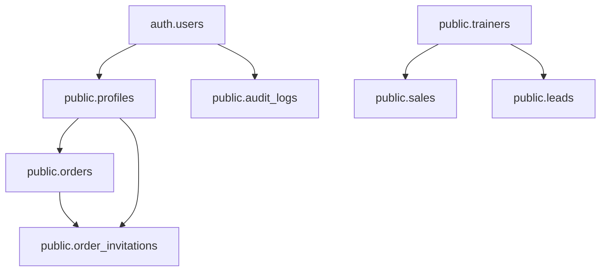

# Sunny — Database Schema, RLS, Triggers (Supabase Postgres)

This document is the **database contract** for Sunny: tables, fields, relationships, RLS policies, helper functions, triggers, and required views.

It is written so you can copy/paste into an agentic AI (or directly into Supabase SQL Editor) to recreate the full backend.

## Important parity notes (current frontend expectations)
The frontend expects columns that are **not present** in the current `batman.sql` snapshot:
- `public.sales` must include: `buyer_name`, `buyer_contact`
- `public.leads` must include: `buyer_name`, `buyer_contact`, `trainer_contact`
- A view `public.trainer_rankings` must exist (used by the Overview page)

This spec includes those fields and the view.

---

## Entity Relationship Diagram (ERD)



---

## Enum types

### `public.user_role_enum`
- Values: `admin`, `sales`, `partner`

---

## Tables (data dictionary)

### 1) `public.profiles`
**Purpose**: application profile row for each auth user; stores role and onboarding metadata.

| Column | Type | Nullable | Default | Notes |
|---|---|---:|---|---|
| id | uuid | no | — | PK, FK → `auth.users(id)` ON DELETE CASCADE |
| email | text | yes | — | copied from auth user |
| full_name | text | yes | — | used for partner identity matching |
| role | user_role_enum | no | `partner` | access control source-of-truth |
| date_of_birth | date | yes | — | onboarding capture |
| phone_number | text | yes | — | used for identity matching |
| notes | text | yes | — | internal notes |
| created_at | timestamptz | yes | `now()` | |
| updated_at | timestamptz | yes | `now()` | |

### 2) `public.trainers`
**Purpose**: partner directory (operational). The current app uses “trainer” == “partner”.

| Column | Type | Nullable | Default | Notes |
|---|---|---:|---|---|
| id | uuid | no | `gen_random_uuid()` | PK |
| name | text | no | — | must match partner `profiles.full_name` for partner ownership logic |
| contact | text | yes | — | phone/email (stored as text) |
| notes | text | yes | — | |
| created_at | timestamptz | yes | `now()` | used as “joining date” |

### 3) `public.sales`
**Purpose**: unit allocation + customer purchase details.

| Column | Type | Nullable | Default | Notes |
|---|---|---:|---|---|
| id | uuid | no | `gen_random_uuid()` | PK |
| trainer_id | uuid | yes | — | FK → `public.trainers(id)` ON DELETE CASCADE |
| units_assigned | int | yes | `0` | allocation size |
| units_sold | int | yes | `0` | partner updates this via dashboard |
| retracted_units | int | yes | `0` | admin/sales “retract” flow updates this |
| date_of_assignment | date | yes | `CURRENT_DATE` | CTA window source |
| purchase_date | date | yes | — | date of purchase |
| buyer_name | text | yes | — | used in search + display |
| buyer_contact | text | yes | — | used for calling |
| picture_url | text | yes | — | public URL to customer picture |
| qr_code_url | text | yes | — | optional QR URL |
| customer_notes | text | yes | — | partner notes |
| created_at | timestamptz | yes | `now()` | |

### 4) `public.leads`
**Purpose**: CRM lead tracking.

| Column | Type | Nullable | Default | Notes |
|---|---|---:|---|---|
| id | uuid | no | `gen_random_uuid()` | PK |
| trainer_id | uuid | yes | — | FK → `public.trainers(id)` ON DELETE SET NULL |
| trainer_contact | text | yes | — | convenience capture of partner contact at lead time |
| buyer_name | text | no | — | required in UI |
| buyer_contact | text | yes | — | |
| status | text | yes | `'new'` | values used: `new|converted|lost` |
| notes | text | yes | — | optional lead notes |
| created_at | timestamptz | yes | `now()` | |

### 5) `public.audit_logs`
**Purpose**: append-only audit trail for CRUD actions.

| Column | Type | Nullable | Default | Notes |
|---|---|---:|---|---|
| id | uuid | no | `gen_random_uuid()` | PK |
| user_id | uuid | yes | — | FK → `auth.users(id)` ON DELETE SET NULL |
| user_name | text | yes | — | display name or email |
| action_type | text | yes | — | check: `CREATE|UPDATE|DELETE` |
| entity_type | text | yes | — | e.g. `trainer|lead|sale|retract` |
| entity_id | uuid | yes | — | |
| description | text | yes | — | may contain `" | "` separator |
| old_values | jsonb | yes | — | |
| new_values | jsonb | yes | — | |
| metadata | jsonb | yes | — | |
| created_at | timestamptz | yes | `now()` | |

### 6) `public.orders`
**Purpose**: partner-level allocation records used for partner KPIs and invitation workflows.

| Column | Type | Nullable | Default | Notes |
|---|---|---:|---|---|
| id | uuid | no | `gen_random_uuid()` | PK |
| partner_id | uuid | yes | — | FK → `public.profiles(id)` ON DELETE CASCADE |
| units_assigned | int | yes | `0` | |
| units_sold | int | yes | `0` | |
| units_retracted | int | yes | `0` | |
| unit_price | numeric | yes | `100` | used for revenue computation |
| status | text | yes | `'active'` | check: `pending|active|completed|cancelled` |
| assigned_at | timestamptz | yes | `now()` | |
| created_at | timestamptz | yes | `now()` | |
| updated_at | timestamptz | yes | `now()` | |

### 7) `public.order_invitations`
**Purpose**: invitation workflow (offer units, accept/decline).

| Column | Type | Nullable | Default | Notes |
|---|---|---:|---|---|
| id | uuid | no | `gen_random_uuid()` | PK |
| order_id | uuid | yes | — | FK → `public.orders(id)` ON DELETE CASCADE |
| partner_id | uuid | yes | — | FK → `public.profiles(id)` ON DELETE CASCADE |
| invited_by | uuid | yes | — | FK → `public.profiles(id)` ON DELETE SET NULL |
| units_offered | int | no | — | |
| message | text | yes | — | |
| status | text | yes | `'pending'` | check: `pending|accepted|declined` |
| created_at | timestamptz | yes | `now()` | |
| responded_at | timestamptz | yes | — | set on response |
| expires_at | timestamptz | yes | — | optional |

---

## Views (required)

### `public.trainer_rankings` (required by Admin Overview)
**Purpose**: compute partner ranking and summary totals for charts.

Required columns in the view result:
- `trainer_id`, `trainer_name`, `trainer_contact`
- `total_units_assigned`, `total_units_sold`, `rank`

Recommended definition:

```sql
create or replace view public.trainer_rankings as
select
  t.id as trainer_id,
  t.name as trainer_name,
  t.contact as trainer_contact,
  coalesce(sum(s.units_assigned), 0) as total_units_assigned,
  coalesce(sum(s.units_sold), 0) as total_units_sold,
  dense_rank() over (order by coalesce(sum(s.units_sold), 0) desc) as rank
from public.trainers t
left join public.sales s on s.trainer_id = t.id
group by t.id, t.name, t.contact;
```

---

## Helper functions (RLS support)
All helper functions are **SECURITY DEFINER** and **STABLE**.
- `public.is_admin()` → boolean
- `public.is_sales()` → boolean
- `public.is_partner()` → boolean
- `public.is_admin_or_sales()` → boolean
- `public.is_service_role()` → boolean (detect dashboard/service role context)

These functions should check `public.profiles.role` for `auth.uid()`.

---

## Triggers (required)

### 1) `public.handle_new_user()`
- Trigger: `AFTER INSERT ON auth.users`
- Purpose: auto-create `public.profiles` row on signup.
- Behavior:
  - map `raw_user_meta_data.role` into the enum (unknown → partner).
  - do not block signup if insert fails.

### 2) `public.prevent_role_change()`
- Trigger: `BEFORE UPDATE ON public.profiles` **when role changes**
- Purpose: prevent unauthorized role changes.
- Allow role change if:
  - service role, OR
  - unauthenticated context, OR
  - requester is admin, OR
  - within a short onboarding window after profile creation.

### 3) Invitation acceptance → order allocation (recommended, matches intended UI)
The invitation UI implies accepted invitations should update orders. Implement one of:
- **(Preferred)** database trigger on invitation acceptance
- application code that updates `orders` in the same transaction

Recommended trigger approach:
- When `order_invitations.status` transitions to `accepted`, update:
  - `orders.units_assigned = orders.units_assigned + NEW.units_offered`
  - `orders.status = 'active'` (or keep `'pending'` if you prefer)
  - `orders.updated_at = now()`

Example trigger function:

```sql
create or replace function public.apply_invitation_acceptance()
returns trigger
language plpgsql
security definer
as $$
begin
  if (tg_op = 'UPDATE')
     and (old.status is distinct from new.status)
     and (new.status = 'accepted') then

    update public.orders o
    set
      units_assigned = coalesce(o.units_assigned, 0) + coalesce(new.units_offered, 0),
      status = case when o.status = 'cancelled' then o.status else 'active' end,
      updated_at = now()
    where o.id = new.order_id;
  end if;

  return new;
end;
$$;

drop trigger if exists order_invitation_acceptance_trigger on public.order_invitations;
create trigger order_invitation_acceptance_trigger
after update on public.order_invitations
for each row
execute function public.apply_invitation_acceptance();
```

---

## RLS policies (required)
All tables must have **RLS enabled**.

### `public.profiles`
- SELECT:
  - user can read own profile (`auth.uid() = id`)
  - admin can read all
  - sales can read all
- INSERT:
  - allow service role / triggers
  - allow admin
  - allow sales inserting only partner profiles
  - allow self insert (`auth.uid() = id`)
- UPDATE:
  - user can update own
  - admin can update all
  - sales can update partner profiles only
- DELETE:
  - admin can delete non-admin
  - sales can delete partner profiles

### `public.trainers`
- SELECT:
  - admin/sales: all
  - partner: readable (needed for matching)
- INSERT:
  - admin/sales: allowed
  - partner: allowed only when the inserted trainer matches their identity (name/contact matches profile full_name/phone/email)
- UPDATE/DELETE:
  - admin/sales only

### `public.sales`
- SELECT/INSERT/UPDATE/DELETE:
  - admin/sales: all
  - partner: only rows where `sales.trainer_id` links to a trainer whose name/contact matches the partner’s profile identity fields

### `public.leads`
- admin/sales: full CRUD
- partner: no access

### `public.audit_logs`
- SELECT: admin only
- INSERT: any authenticated user
- UPDATE/DELETE: typically disabled (no policies) to keep append-only semantics

### `public.orders`
- SELECT:
  - admin/sales: all
  - partner: only own orders (`partner_id = auth.uid()`)
- INSERT/UPDATE:
  - admin/sales: allowed
  - partner: may update own (optional; only if required)
- DELETE:
  - admin only

### `public.order_invitations`
- SELECT:
  - admin/sales: all
  - partner: only own invitations (`partner_id = auth.uid()`)
- INSERT/UPDATE/DELETE:
  - admin/sales: allowed
  - partner: update only own invitations (respond accept/decline)

---

## Supabase Storage (required)

### Bucket
- `customer-pictures`

### Policy recommendation (storage)
To make partner uploads safe, prefer a **user-scoped path convention**:
- object key: `auth.uid()/<randomfilename>`
- then write storage policies to allow:
  - insert/select where `bucket_id = 'customer-pictures'` and `auth.uid()` matches the prefix

If you keep flat paths (no user prefix), you need broader policies; avoid that in production.

---

## Idempotent “single script” approach (recommended)
When generating the system, create a single SQL script that:
- creates/updates tables (using `create table if not exists` + `alter table add column if not exists`)
- recreates required views
- creates functions + triggers
- drops/recreates RLS policies to keep the script rerunnable

