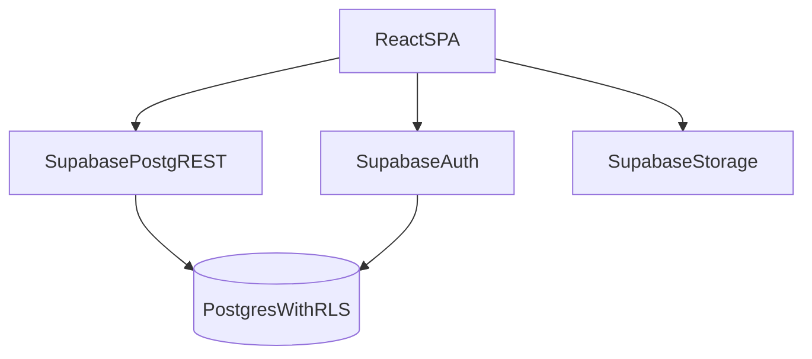

# Sunny — Tech Stack & Architecture

## Stack summary

### Frontend
- **React** `^19.2.0`
- **Vite** `^7.2.4`
- **React Router DOM** `^7.11.0`
- **Tailwind CSS** `^4.1.18` + `@tailwindcss/vite`
- **Recharts** `^3.6.0`
- **ESLint** `^9.39.1`

### Backend (BaaS)
- **Supabase**
  - Auth (email/password)
  - Postgres
  - Row Level Security (RLS)
  - Storage (customer pictures bucket)

## Repository structure (expected)
- `src/components/` — reusable UI (modals, fields, KPI cards, tables)
- `src/pages/` — route-level screens
- `src/context/` — auth context
- `src/lib/` — Supabase client + utilities (audit, admin)
- `src/router.jsx` — route definitions
- `batman.sql` — database setup (schema + RLS); treat as single “run in SQL editor” file

## Environment configuration

### Required variables
- `VITE_SUPABASE_URL`
- `VITE_SUPABASE_ANON_KEY`

### Supabase client creation
The app creates a Supabase browser client from env vars and should fail gracefully if missing.

## Auth model

### Identity source of truth
- Supabase Auth user: `auth.users`
- Application profile + role: `public.profiles` (1:1 with `auth.users`)

### Session & profile loading pattern
- On app boot:
  - call `supabase.auth.getSession()`
  - if authenticated, fetch `public.profiles` for the current user id
- Subscribe to `supabase.auth.onAuthStateChange` to react to sign-in/sign-out events.

### Role-based routing
Client should enforce:
- `/admin/*` allowed for roles: `admin|sales`
- `/admin/audit-logs` allowed only for `admin`
- `/partner/*` allowed only for `partner`

Backend RLS policies must remain the authoritative enforcement.

### Session restoration during onboarding
When creating other users, the app must not permanently replace the current admin/sales session.
Recommended approach:
- capture current session tokens
- perform sign-up / user creation
- restore original session via `supabase.auth.setSession(...)`
- temporarily suppress “profile refetch races” during restoration.

## Authorization model

### Layer 1: client UX gating
- Route guards for required role(s)
- Hide nav items and actions based on role

### Layer 2: database RLS (source of truth)
All critical access checks are enforced server-side in Postgres with RLS policies.

## Data access pattern
- All reads/writes happen via `@supabase/supabase-js` directly from the SPA.
- Most list pages read with:
  - `.select(...)` with nested joins (e.g., `sales` joined to `trainers`)
  - sorting by `created_at` or business dates (`date_of_assignment`, `purchase_date`)
- Audit events are inserted as separate writes into `audit_logs`.

## Storage (customer pictures)

### Bucket
- `customer-pictures`

### Object naming
Common pattern:
- object path is a generated filename
- store the resulting `publicUrl` in `public.sales.picture_url`

### Security note
Supabase Storage access is controlled by storage policies. You should create policies that allow:
- partners to upload to the bucket
- partners to read objects they own (recommended: store under a user-specific prefix)
- admins/sales to read all objects (optional)

## Deployment

### GitHub Pages SPA hosting
- Router uses a **basename** of `/sunny` for subpath hosting.
- Deployment can be:
  - GitHub Actions workflow, or
  - manual `npm run deploy` (build then publish `dist/`)

### Build-time env requirements
Because GitHub Pages is static hosting:
- `VITE_SUPABASE_URL` and `VITE_SUPABASE_ANON_KEY` must be provided at build time.

## Known production hardening items (recommended)

### Admin user creation
If the system needs to create users programmatically:
- Prefer a Supabase **Edge Function** (server-side) for user creation and profile setup.
- Do not expose service-role keys in the SPA.

### Data integrity constraints
Add server-side constraints or triggers to enforce:
- non-negative units
- \(units\_sold + retracted\_units \le units\_assigned\)

## Architecture diagram (logical)

